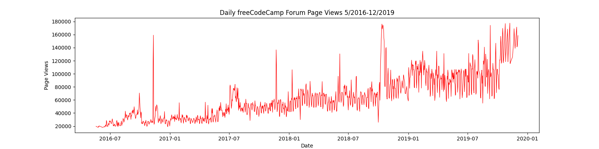

# data_anlaysis_python

---

Some exercises in analyzing data with python from freecodecamp practice

Some exercise titles :

- [x] Mean-Variance-Standard Deviation Calculator
- [x] Demograpic Data Analyzer
- [x] Medical Data Visualizer
- [x] Page View Time Series Visualiser
- [x] Sea Level Predictor

---

## Mean-Variance-std_deviation calculator

This challenge creates a calculator that calculates mean, standard deviation, variation and accepts 3 x 3 matrix values with the following output values:

```
{
  'mean': [axis1, axis2, flattened],
  'variance': [axis1, axis2, flattened],
  'standard deviation': [axis1, axis2, flattened],
  'max': [axis1, axis2, flattened],
  'min': [axis1, axis2, flattened],
  'sum': [axis1, axis2, flattened]
}

```

---

## Demograpic Data Analyzer

In this challenge you must analyze demographic data using Pandas. You are given a dataset of demographic data that was extracted from the 1994 Census database.

---

## Medical Data Visualizer

This project creates a data visualization of a dataset that represents patients and the columns represent information such as body size, results from various blood tests, and lifestyle choices, create a similar chart based on the specified image, show the counts of good and bad outcomes for the cholesterol, gluc, alco, active, and smoke variables for patients with **cardio=1** and **cardio=0** in different panels.

for example image :


create **correlation matrix** using the dataset. Plot the correlation matrix using seaborn's.

for example image :


## Page View Time Series Visualizer

For this project make vizualize time series data using line chart, bar chart and box chart. with library pandas, matplotlib and seaborn from dataset containing the number views each day on the freecodecamp.org forum 2016 to 2019.

> First draw line plot like this.



> Second draw bar chart it should show avarage daily page views for each month grouped by yaer


> Third create box plot with seaborn like similar to example this


---

## Sea Level Predictor

To be want to analyze a dataset of the global avarage sea level change since 1980
and predict the sea level change through 2050

and the result project like this:


> [!NOTE]
> you can see full descriptions on [freecodecamp data analysis with python project](https://www.freecodecamp.org/learn/data-analysis-with-python/data-analysis-with-python-projects/)
